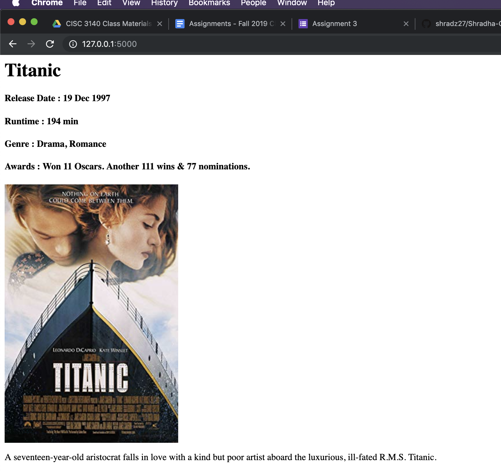

# Shradha-CISC3140Assignments

### Introduction
Flask app fetches the "Titanic" movie data with poster from [omdb](http://omdbapi.com) api.  

### Installing the dependencies
[Install python package manager pip.](https://pip.pypa.io/en/stable/installing/) Once installed run following command.

	pip install -r requirements.txt
	
### Running the app
	python app.py

Running above command displays the server's address in console. For reference following is the example.

		* Serving Flask app "app" (lazy loading)
		* Environment: production
		WARNING: This is a development server. Do not use it in a production deployment.
		Use a production WSGI server instead.
		* Debug mode: off
		* Running on http://127.0.0.1:5000/ (Press CTRL+C to quit)

Go to browser and load the server url (console has the url).
http://127.0.0.1:5000/

Below is the screenshot of the webpage.

